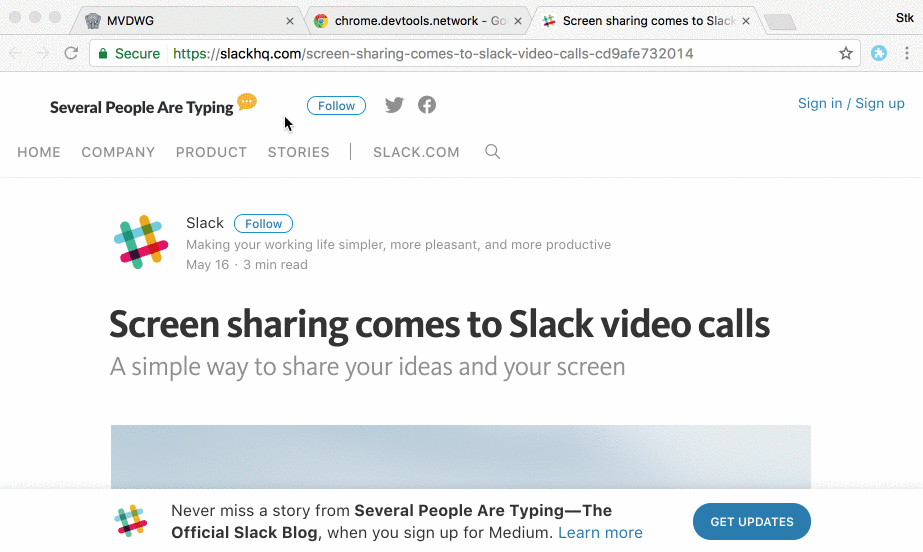

# Workspaces

Chrome plugin to aid users with bookmark groups. The idea is to be able to
define different workspaces by saving current window tabs as a group.

## Development

* `git clone` this repository
* Make the changes you want
* Open a pull request

## License

workspaces is licensed under the MIT license.

See [LICENSE](./LICENSE) for the full license text.
